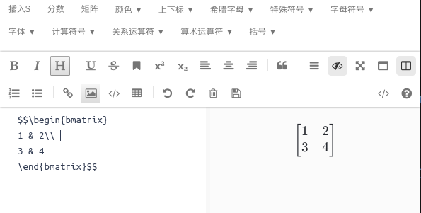

# mathjax-toolbar

> A Vue.js Toolbar Plugin to Insert Mathjax Code.

## github
[https://github.com/zmj97/mathjax-toolbar](https://github.com/zmj97/mathjax-toolbar)

## How to Use

``` bash
# install this plugin
npm install mathjax-toolbar --save
```

```vue
// main.js
import mathjaxToolbar from 'mathjax-toolbar'
Vue.use(mathjaxToolbar)

// xxx.vue
/* contentId传入插入文本的结点或父节点的id,
 * 需要注意的是，当传入的为父节点时，则自动插入到第一个textarea子节点中，
 * 没有textarea子节点时插入到input子节点中
 */
<mathjax-toolbar contentId="editor"></mathjax-toolbar>
//插入文本的地方，这里用mavon editor为例， 也可以直接使用textarea或input
<mavon-editor
 id="editor"
 v-model="value" 
 :ishljs="true"
/>
```

### Preview



其中`插入$` 到 `括号`即为`mathjax-toolbar`

For detailed explanation on how things work, consult the [docs for vue-loader](http://vuejs.github.io/vue-loader).